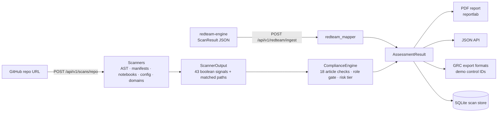

# AuditLens

**Turns AI-agent security findings into an EU AI Act gap assessment, with article citations and a PDF report.**

AuditLens is the compliance half of a two-repo system:

| Repo | Role | One line |
|---|---|---|
| [redteam-engine](https://github.com/paawandesai/redteam-engine) | Attack | Runs adversarial prompts and multi-turn attack chains against LangGraph agents and grades what the agent actually did. |
| **AuditLens** (this repo) | Assess | Maps those findings, or a scan of a GitHub repo, onto EU AI Act articles and produces a cited, scored assessment as JSON and PDF. |

```
redteam-engine                                   AuditLens
──────────────                                   ─────────
redteam scan  ──► ScanResult JSON ──► redteam push ──►  POST /api/v1/redteam/ingest(/pdf)
(113 prompts, 10 multi-turn chains)                        │
                                                           ▼
                                        redteam_mapper: findings → ComplianceChecks
                                        prompt-injection-rag → Art. 9   tool-misuse → Art. 14
                                                           │
                                                           ▼
                                        PDF report with an Adversarial Testing section
```

The red-team result that motivates it: redteam-engine ran a three-message account takeover (look up the account, change its email, send a password reset) against a support agent deliberately built without authorization gates. The chain completed on all four models tested: GPT-4o, GPT-4o-mini, Claude Sonnet 4 and Claude Haiku 4.5. See [redteam-engine/FINDINGS.md](https://github.com/paawandesai/redteam-engine/blob/main/FINDINGS.md). AuditLens maps tool-misuse findings like this one to Article 14 (human oversight). Pushing redteam-engine's GPT-4o benchmark scan gives a critical FAIL on Art. 14, from 11 failed tool-misuse prompts, and on Art. 9, from 5 RAG-injection failures.

## What it does

Both input paths produce the same `AssessmentResult`, which feeds the PDF report, the JSON API, and the GRC export formats.

1. **Adversarial path.** `POST /api/v1/redteam/ingest` takes red-team findings. Each finding becomes a sub-check under its primary article (`app/services/redteam_mapper.py`), with citations from `app/services/compliance/citations.py`. This path skips the repo scanner because a graded attack transcript says more than a file-presence flag can.
2. **Repository path.** `POST /api/v1/scans/repo` reads a public GitHub repo through the REST API (AST import analysis, manifests, notebooks, config files, doc detection, Annex III domain keywords). It then runs 18 article check classes with 83 sub-checks, covering Art. 5, 6, 8–17, 26, 27, 50, 53, 55 and 72.

### Role-based scoping

EU AI Act obligations depend on who you are. A deployer owes a Fundamental Rights Impact Assessment (Art. 27); a library author does not. Scans take a declared `role` (`provider`, `deployer`, `both`, `gpai`, `gpai_systemic`, `library`, `tool`). Out-of-scope articles return `N/A` and never touch the score. With no role declared, which is the default, deployer-only (Art. 26, 27) and GPAI-model (Art. 53, 55) obligations are not scored, and the report is marked INDICATIVE. See `app/services/compliance/applicability.py`.

## Architecture



| Layer | Where |
|---|---|
| API (FastAPI, Pydantic v2) | `backend/app/main.py`, `backend/app/routers/` |
| Repo scanners | `backend/app/scanners/` |
| Compliance engine + 18 article checks | `backend/app/services/compliance/` |
| Red-team mapper | `backend/app/services/redteam_mapper.py` |
| PDF report | `backend/app/services/pdf/` |
| GRC export adapters | `backend/app/services/grc/` |
| Storage | `backend/app/storage/sqlite_store.py` |
| Static frontend | `frontend/index.html`, `frontend/scanner.html` |

## What's real and what isn't

| Area | Status |
|---|---|
| Red-team ingestion → Art. 9 / 12 / 14 / 15 assessment + PDF | **Working.** Verified end to end with a real redteam-engine scan (`redteam push` → local AuditLens → PDF). |
| Role-based scoping, risk-tiered scoring, N/A handling | **Working**, with tests. |
| Repo scanning (AST imports, manifests, notebooks, config, domain detection) | **Working, but shallow.** Most article sub-checks test whether a file with the right name or keywords *exists*, not whether its content meets the requirement. Empty-file stubs are rejected for Art. 9 and 11 only. |
| Risk classification (Annex III) | **Heuristic.** Keyword matching on repo text; it is not a legal classification. |
| PDF reports | **Working.** Article-cited, but indicative. A notified body would want commit hashes, harmonised-standard mappings, and attestation, none of which the report has. |
| Vanta / Drata / Secureframe exports | **Format demo.** The payload shapes are modelled on each platform, but the control IDs are illustrative placeholders, not real platform IDs. Every export carries `"mapping_status": "demo"` and a notice, and the UI labels it. |
| Red-team categories `cross-agent-injection`, `memory-poisoning` | Mapping is defined (Art. 15 / Art. 12). redteam-engine has no prompts for them yet. |
| Persistence | SQLite at `backend/data/auditlens.db`. On Render's free tier the disk is ephemeral, so stored scans are lost on restart. |
| Auth | JWT / API key on GRC export only. Scanning, PDF and ingestion endpoints are public and IP rate-limited. |
| LLM document analysis (optional) | Uploaded evidence documents are sent to the Anthropic API when `AUDITLENS_LLM_ENABLED=true` and a key is set. Off otherwise. |

AuditLens produces a gap analysis, not legal advice or a conformity assessment.

## Run it

Requires Python 3.11+.

```bash
cd backend
python3 -m venv .venv && source .venv/bin/activate
pip install -e '.[dev]'

AUDITLENS_AUTH_ENABLED=false uvicorn app.main:app --reload --port 8000
# API docs: http://localhost:8000/docs
# Frontend:  cd ../frontend && python3 -m http.server 3000
#            (edit the <meta name="api-url"> tag in the HTML to use your local API)
```

Scan a repo with a declared role:

```bash
curl -X POST localhost:8000/api/v1/scans/repo \
  -H 'Content-Type: application/json' \
  -d '{"repository_url": "https://github.com/org/repo", "role": "provider"}'
```

Push red-team results from redteam-engine into your local instance:

```bash
cd ../redteam-engine
uv run redteam push results/cross-model-v2/gpt4o/scan-20260427-182339.json \
  --endpoint http://localhost:8000/api/v1/redteam/ingest/pdf
# → compliance-report-<scan_id>.pdf (Art. 14 FAIL: 11 tool-misuse failures; Art. 9 FAIL: 5 RAG-injection failures)
```

Without `--endpoint`, `redteam push` posts to the hosted instance at `auditlens-9hox.onrender.com`.

Set `GITHUB_TOKEN` to raise GitHub's anonymous limit of 60 requests/hour. Other settings are listed in `backend/.env.example`.

## Tests

```bash
cd backend && pytest -q
# 554 passed, 24 skipped
```

The 24 skipped tests are live "golden repo" scans that run against GitHub and need `GITHUB_TOKEN`.

## Further reading

- [COMPLIANCE_VERIFICATION.md](COMPLIANCE_VERIFICATION.md): each sub-check cross-referenced against the regulation text, with known gaps.
- [VERIFICATION.md](VERIFICATION.md): article coverage and engine verification (written at 508 tests; the coverage tables still apply).
- [redteam-engine](https://github.com/paawandesai/redteam-engine): the attack side, its findings, and a self-conducted methodology audit.
